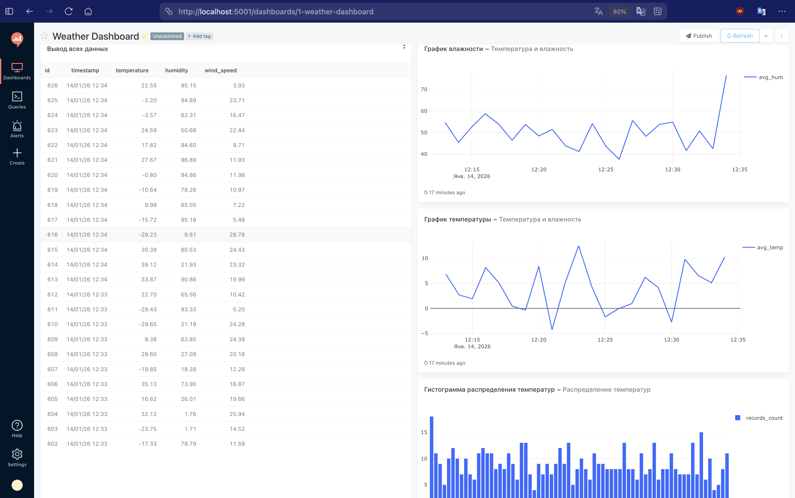
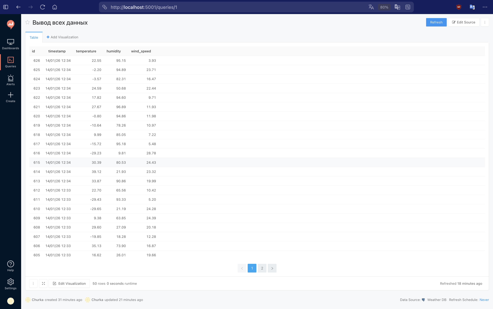

# Мини-система сбора и анализа данных (Погодная станция)

Проект реализует end-to-end систему сбора, хранения и анализа данных с погодной станции.

## Компоненты

1.  **Generator**: Python-скрипт, генерирующий данные о погоде (температура, влажность, давление, скорость ветра) каждые 2 секунды.
2.  **Database**: PostgreSQL (хранит данные измерений в БД `analytics_db` таблицу `weather_data` и метаданные Redash в БД `redash`).
3.  **Redash**: Инструмент для визуализации и построения дашбордов.
4.  **Jupyter Notebook**: Среда для исследовательского анализа данных.

## Запуск

### Предварительные требования

- Docker
- Docker Compose

### Инструкция

1.  **Запуск контейнеров:**

    ```bash
    docker-compose up -d
    ```

2.  **Инициализация Redash (Только при первом запуске!):**
    Необходимо создать таблицы в базе данных для Redash.

    ```bash
    docker-compose run --rm redash manage database create_tables
    ```

3.  **Доступ к интерфейсам:**
    - **Redash**: [http://localhost:5001](http://localhost:5001)
    - **Jupyter Notebook**: [http://localhost:8888](http://localhost:8888) (Токен для входа: `analyze`)

## Настройка Redash

1.  Откройте [http://localhost:5001](http://localhost:5001).
2.  Зарегистрируйте аккаунт администратора.
3.  **Добавление источника данных (Data Source):**

    - Settings -> Data Sources -> New Data Source
    - Выберите **PostgreSQL**.
    - Host: `db`
    - User: `postgres`
    - Password: `postgres`
    - Database Name: `analytics_db` \* **Примечание:** Так как мы используем одну БД для всего, таблицы Redash и данные погоды будут в одной базе `analytics_db`.
    - Нажмите **Save** и **Test Connection**.

4.  **Создание запроса:**

    - Queries -> New Query
    - SQL: `SELECT * FROM weather_data ORDER BY timestamp DESC`
    - Нажмите **Execute**.

5.  **Создание визуализаций (пример):**
    - Ниже результатов запроса нажмите **Adding Visualization**.
    - Выберите Chart Type: **Line**.
    - X Column: `timestamp`
    - Y Columns: `temperature`, `humidity`.

## Анализ в Jupyter

1.  Откройте [http://localhost:8888](http://localhost:8888).
2.  Введите токен: `analyze`.
3.  Откройте файл `work/analysis.ipynb`.
4.  Запустите ячейки для подключения к БД и построения графиков.

## Структура БД (Таблица weather_data)

- `id`: unique identifier
- `timestamp`: время измерения
- `temperature`: температура (C)
- `humidity`: влажность (%)
- `pressure`: давление (мм рт.ст.)
- `wind_speed`: скорость ветра (м/с)

## Скриншоты



